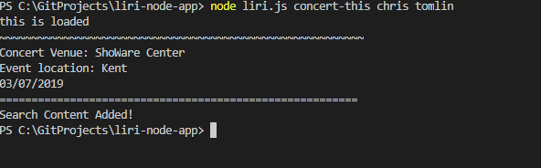

# LIRI Bot

### Overview

LIRI is like iPhone's SIRI. However, while SIRI is a Speech Interpretation and Recognition Interface, LIRI is a _Language_ Interpretation and Recognition Interface. LIRI is a command line node app that takes in parameters and gives you back data.

### How it works

1. LIRI searches Spotify for songs, Bands in Town for concerts, and OMDB for movies.

### Technology used

To retrieve the data that powers this app, the app sends requests to the Bands in Town, Spotify and OMDB APIs. 

   * [Node-Spotify-API](https://www.npmjs.com/package/node-spotify-api)

   * [Request](https://www.npmjs.com/package/request)

     * The app uses Request to grab data from the [OMDB API](http://www.omdbapi.com) and the [Bands In Town API](http://www.artists.bandsintown.com/bandsintown-api)

   * [Moment](https://www.npmjs.com/package/moment)

   * [DotEnv](https://www.npmjs.com/package/dotenv)
   
## See the app in actions

### Screenshots
Since this is a Commandline app (CLI app), these screenshots show how the appp works.

* Screenshots.
    * Typical user flow.

    When a user types node liri.js the app tells them that they need to specify what they'd like liri to search for.
    There are 4 options; movie-this, concert-this, spotify-this-song and do-what-it-says.

#### Movie-this
This searches the OMDb API and renders the following information about each movie to the terminal:
  * Title of the movie.
  * Year the movie came out.
  * IMDB Rating of the movie.
  * Rotten Tomatoes Rating of the movie.
  * Country where the movie was produced.
  * Language of the movie.
  * Plot of the movie.
  * Actors in the movie.

 

#### Concert-This
This searches the Bands in Town Artist Events API ("https://rest.bandsintown.com/artists/" + artist + "/events?app_id=codingbootcamp") for an artist and renders the following information about each event to the terminal:

* Name of the venue
* Venue location
* Date of the Event (formatted with moment as "MM/DD/YYYY")

  

#### Spotify-this-song
LIRI will search Spotify for songs, and present the following information:

* Artist(s)
* The song's name
* A preview link of the song from Spotify
* The album that the song is from
  

#### Do What it Says
For Do-what-it-says, LIRI uses the fs Node package to take the text inside of random.txt and then use it to call one of LIRI's commands.
  

### Log

In addition to logging the data to your terminal/bash window, the search data is saved in log.txt

